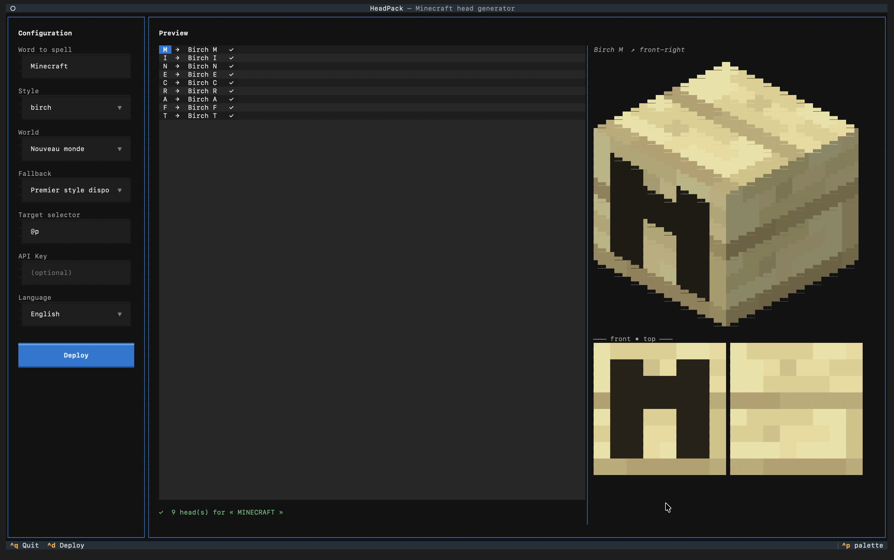

# HeadPack

A CLI/TUI tool to spell words using Minecraft player heads — fetches alphabet head skins from [minecraft-heads.com](https://minecraft-heads.com), generates the `/give` commands, and deploys them as a datapack directly into your world.

```
headpack MINECRAFT
```



---

## Features

- **Interactive TUI** with a real-time isometric 3D preview of each head
- **4 rotation views** (←/→) with synchronized flat face inspection (Ctrl+F)
- **Multiple styles** — quartz, oak, iron, birch, and many more
- **Flexible fallback** — use the closest available style, skip missing letters, or raise an error
- **One-command deploy** — installs a datapack and writes the mcfunction to your world
- **CLI mode** — pipe-friendly output for scripting (`--output commands` or `--output mcfunction`)

---

## Requirements

- Python 3.11+
- Minecraft Java Edition (for deployment)
- A terminal with true-color support for the TUI preview

---

## Installation

```bash
pip install headpack
```

Or from source:

```bash
git clone https://github.com/NeXiiLiuM/headpack
cd headpack
pip install -e .
```

## API Key 

Get your API Key here : https://minecraft-heads.com/api

Then create a .env file in the same directory as the script and add the following line:

```bash
MINECRAFT_HEADS_API_KEY=your_key
```

You can also add the path to your Minecraft world and set the default language in the same file:

```bash
MINECRAFT_HEADS_API_KEY=your_key
HEADPACK_WORLD_PATH=path/to/your/.minecraft/saves/your_world
HEADPACK_LANG=en
```

---

## Usage

### TUI (interactive)

```bash
headpack        # launch the TUI
hpk             # short alias
```

Type your word, pick a style, select your world, and press **Ctrl+D** to deploy.

#### TUI keyboard shortcuts

| Key | Action |
|---|---|
| ↑ / ↓ | Navigate letters |
| ← / → | Rotate head preview (4 views) |
| Ctrl+F | Toggle flat face view (lateral + top/bottom) |
| Ctrl+D | Deploy to selected world |
| Ctrl+Q / Esc | Quit |

### CLI

```bash
# Deploy directly (default)
headpack "HELLO" --style quartz

# Print /give commands to stdout
headpack "HELLO" --style oak --output commands

# Generate a .mcfunction file
headpack "HELLO" --output mcfunction > give.mcfunction
```

#### Options

| Option | Default | Description |
|---|---|---|
| `--style` | `quartz` | Head style (quartz, oak, iron, birch…) |
| `--fallback` | `first` | `first` = use closest style · `skip` = omit letter · `error` = fail |
| `--selector` | `@p` | Minecraft target selector (`@p`, `@a`, player name…) |
| `--output` | `deploy` | `deploy` · `commands` · `mcfunction` |
| `--world-path` | auto-detect | Path to Minecraft world folder |
| `--api-key` | env var | minecraft-heads.com API key |
| `--install` | — | Install the datapack into the world and exit |
| `--list-styles` | — | List all available head styles |
| `--list-worlds` | — | List detected Minecraft worlds |
| `--no-cache` | — | Force a fresh fetch from the API |
| `--lang` | env var | Language: `fr` or `en` (also: `HEADPACK_LANG`) |

---

## Deployment

HeadPack installs a lightweight datapack into your world and writes a `give.mcfunction` file. After deploying:

```
/reload
/function headpack:give
```

The first time, run `headpack --install` (or use the deploy button in the TUI — it installs automatically).

---

## Configuration

| Variable | Description |
|---|---|
| `MINECRAFT_HEADS_API_KEY` | API key for minecraft-heads.com (optional, increases rate limits) |
| `HEADPACK_WORLD_PATH` | Default world path (overrides auto-detection) |
| `HEADPACK_LANG` | Default language: `fr` (default) or `en` |

A `.env` file in the working directory is loaded automatically.

---

## Cache

Head data is cached locally at `~/.cache/headpack/` with a 7-day TTL. Clear it with:

```bash
headpack --clear-cache
```

---

## Language 

Currently two languages are available : English and French

If you want to add a language, you can do it in the [`i18n.py`](./headpack/i18n.py) file. Just add a new dictionary with the language code and the strings to translate.

---

## License

No license, do what you want (i am not responsible for anything you do with this tool)
